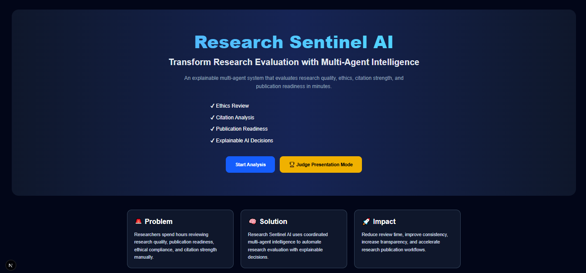
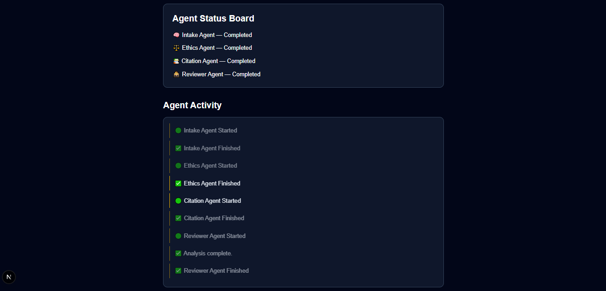
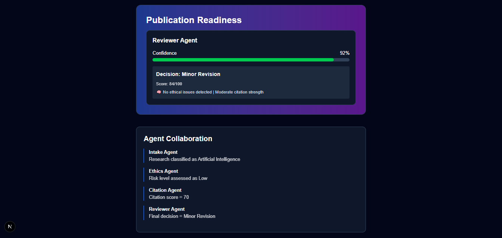

# 🔬 Research Sentinel AI

> **Autonomous Multi-Agent Pre-Publication Peer Review Pipeline**
> Designed & Developed for the *Band of Agents Hackathon* 🚀

---

## 📌 1. Problem Statement
The academic publishing ecosystem is facing a critical bottleneck. The traditional peer-review process suffers from **extreme delays (taking 3-9 months)**, **unconscious reviewer bias**, and **high rates of undetected ethical violations or flawed citations**. This significantly slows down global scientific progress and allows low-quality or fraudulent research to slip through the cracks.

## 💡 2. The Solution
**Research Sentinel AI** introduces a decentralized, autonomous squad of specialized AI agents working collaboratively to evaluate research papers in minutes, not months. By simulating a rigorous, cross-functional peer-review panel, the system provides instant, unbiased, and highly explainable compliance and quality auditing before final publication submission.

---

## 🏗️ 3. Architecture & Agent Coordination
The system utilizes an orchestrator-driven multi-agent state machine designed to scale into the **Band Framework**. Data flows dynamically from raw text ingestion down to collective consensus scoring:

              [ User PDF Ingestion ]
                        │
                        ▼
              [ Orchestrator Engine ]
                        │
     ┌──────────────────┼──────────────────┐
     ▼                  ▼                  ▼
[ Ethics Agent ]   [ Citation Agent ]   [ Reviewer Agent ]
• Compliance Check  • Cross-Referencing  • Quality Grading
│                  │                  │
└──────────────────┼──────────────────┘
▼
[ Collective Consensus Room ]
│
▼
[ Guardrails & Explainable Report ]
│
┌──────────────────┴──────────────────┐
▼                                     ▼
[ Dynamic SaaS Dashboard ]            [ Production PDF Report ]


---

## ✨ 4. Key Features
- **📊 Interactive SaaS Dashboard:** A sleek, dark-themed analytical interface built to monitor live agent reasoning and system throughput logs at a glance.
- **⚖️ Judge Presentation Mode:** A specialized simulation engine built specifically for hackathon demonstrations to showcase sub-second multi-agent internal dialogs and decision pipelines.
- **🧠 Transparent Explainability:** No black boxes. Every agent's score and final consensus decision is backed by explicit text citations and predefined scientific publishing standards.
- **📝 Production-Grade PDF Export:** Instantly compile the collective intelligence report into a downloadable audit document for research teams.

---

## 🛠️ 5. Tech Stack
- **Frontend:** Next.js 15 (React), TypeScript, Tailwind CSS, Lucide Icons
- **Backend:** FastAPI (Python), Uvicorn, Pydantic, Python-dotenv
- **Agent Orchestration:** Custom Async State Machine *(Pre-Band Framework Architecture)*

---

## 🎬 6. Demo Video & Walkthrough

### 🎥 Live Demo Video (2-3 Mins Tour)
[](https://www.youtube.com/watch?v=04QTZSEFC08)

### 📸 Interface Screenshots

#### 1. Executive Ingestion & Landing Control


#### 2. Multi-Agent Live Collaboration (Judge Presentation Mode)


#### 3. Collective Consensus Final Evaluation


---

## 🏁 7. Local Setup & Installation

### Prerequisites
- Python 3.10+
- Node.js 18+

### Step 1: Clone Repository
```bash
git clone [https://github.com/lhasanali/research-sentinel-ai.git](https://github.com/lhasanali/research-sentinel-ai.git)
cd research-sentinel-ai
